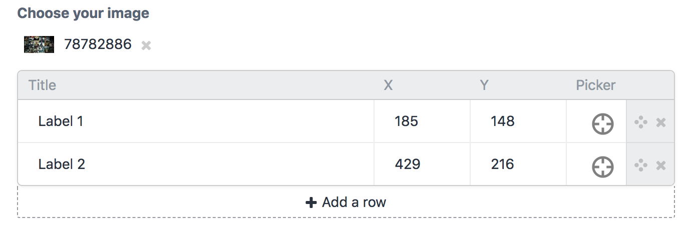

# Battleships plugin for Craft CMS 3.x

Custom Field Type to pick x-y coordinates from an image



## Requirements

This plugin requires Craft CMS 3.0.0 or later.

## Installation

To install the plugin, follow these instructions.

1. Open your terminal and go to your Craft project:

        cd /path/to/project

2. Then tell Composer to load the plugin:

        composer require ournameismud/battleships

3. In the Control Panel, go to Settings → Plugins and click the “Install” button for Battleships.

## Battleships Overview

This plugin lets you build out a map of points on an image.

## Configuring Battleships

The only configuration for this plugin is when creating a field you can specify which assets you can select an image from.

## Using Battleships

1. Choose an image for use with your points data via the `+ Choose` button. 
2. Once you have chosen an image you can add rows for each point. Clicking on the crosshair will bring up a modal where you can select a point on the image. Once confirmed the x and y values of this point will be logged in the table. 
3. You can additionally provide a label/title for the point you have logged.
4. You can remove rows and sort them using the drag and remove icons in the table.

## Battleships Variables

The data from the field will be stored as a JSON string. You can access this directly in your field or pass it through the Battleships `getPos()` template variable, for example:

``

Would return the following:

- `{{ points.asset }}`: an asset Element object
- `{{ points.rows }}`: an array of rows with three values available for each row: label, x and y.

So we can access these, for example, with the following code:

```
    <dl>
    
    	<dt>{{ row.label }}<dt>
    	<dd>X: {{ row.x }}<dd>
    	<dd>Y: {{ row.y }}<dd>
    
    </dl>
```

* Release it

Brought to you by [@cole007](http://ournameismud.co.uk/)  
Plugin Icon by [icon 54](https://thenounproject.com/search/?q=battleships&i=209268)  
Target Icon by [Arthur Shlain](https://thenounproject.com/search/?q=target&i=80655)
